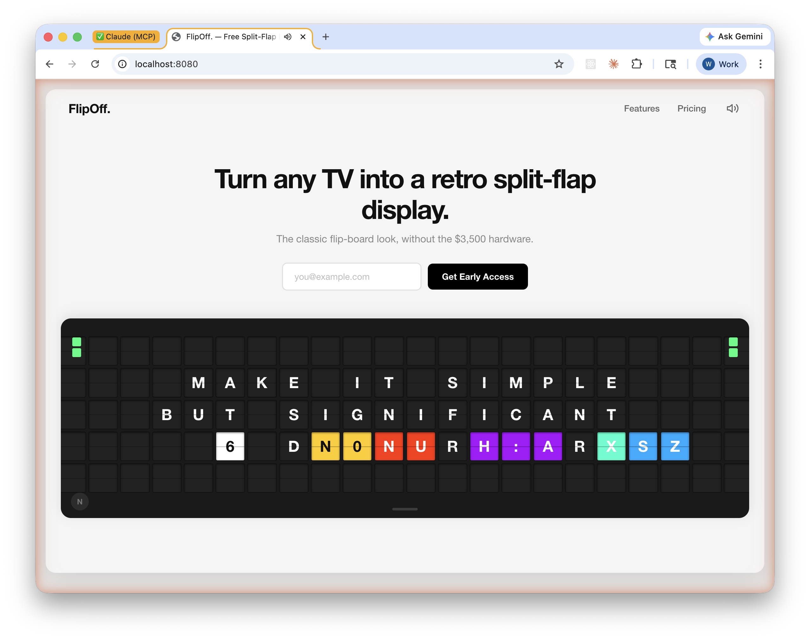

# FlipOff.

**Turn any TV into a retro split-flap display.** The classic flip-board aesthetic, without the $3,500 hardware. No accounts, no subscriptions, no build step. Open the file and go.



---

## What is this?

FlipOff is a free, open-source web app that emulates a mechanical split-flap display -- the kind you'd see at Amtrak stations, airports, and European rail terminals. It runs full-screen in any modern browser, turning a cheap TV or spare monitor into a beautiful ambient display for your office, lobby, workshop, or living room.

The animation system recreates the signature split-flap behavior: each tile independently scrambles through random characters with colorful background flashes before settling on its target character with a subtle 3D tilt. Only tiles whose content actually changes between messages animate, just like the real thing. The whole transition is accompanied by a single recorded audio clip of an actual mechanical split-flap board, played once per message change for authentic synchronized sound.

**Zero dependencies.** No npm, no Webpack, no React. Pure vanilla HTML, CSS, and ES modules. The entire app is ~80KB including the embedded audio clip. It works offline, loads instantly, and runs on anything with a browser.

---

## Features

- **Realistic tile animation** -- Each of the 110 tiles (22x5 grid) scrambles independently through random characters with color-cycling backgrounds before settling on the final character with a mechanical tilt
- **Authentic sound** -- A single recorded clip from a real split-flap board plays once per transition, perfectly synced to the visual animation via the Web Audio API
- **Auto-rotating quotes** -- Six built-in inspirational quotes rotate automatically with configurable timing
- **Fullscreen TV mode** -- Press `F` or click "Launch Display" to go fullscreen, hiding the UI chrome and centering the board on a dark background
- **Keyboard navigation** -- Full keyboard control for message cycling, fullscreen toggle, and mute
- **Responsive across all viewports** -- Fluid `clamp()`-based tile sizing from mobile phones (18px tiles) to 4K displays (65px tiles), with breakpoints at 600px, 900px, 1200px, and 2000px
- **Offline-capable** -- No external requests, no CDN fonts, no analytics. Works without an internet connection
- **Content-Security-Policy hardened** -- Restricts script and style sources via meta tag
- **Keyboard accessible** -- `:focus-visible` indicators on all interactive elements

---

## Quick Start

Clone and open. That's it.

```bash
git clone https://github.com/Avicennasis/flipoff.git
cd flipoff

# Option 1: Open directly
xdg-open index.html        # Linux
open index.html             # macOS

# Option 2: Serve locally (avoids some browser restrictions on file:// origins)
python3 -m http.server 8080
# Then visit http://localhost:8080
```

Click anywhere on the page or press any key to initialize audio (required by browser autoplay policies). Press `F` for fullscreen, or click the "Launch Display" button in the hero section.

---

## Keyboard Shortcuts

| Key | Action |
|-----|--------|
| `Enter` / `Space` / `Arrow Right` | Next message |
| `Arrow Left` | Previous message |
| `F` | Toggle fullscreen |
| `M` | Toggle mute (shows a toast notification) |
| `Escape` | Exit fullscreen / close shortcuts overlay |

A keyboard shortcut reference is also available in-app via the small circular hint button at the bottom-left corner of the board.

---

## Architecture

The app is structured as ES modules with no build step. Each module has a single responsibility:

```
flipoff/
  index.html                — Single-page entry point. Loads CSS and the main module.
  css/
    reset.css               — Box-sizing reset, font smoothing, focus-visible styles
    layout.css              — Page chrome: header, hero section, board container
    board.css               — Board wrapper, accent bars, keyboard hint, shortcuts overlay
    tile.css                — Individual tile faces, split-line seam, GPU compositing hints
    responsive.css          — Five breakpoints (600/900/1200/2000px) + fullscreen mode
  js/
    main.js                 — Entry point. Wires up Board, SoundEngine, MessageRotator,
                              KeyboardController. Handles audio initialization on first
                              user gesture (browser autoplay policy compliance).
    Board.js                — Constructs the 22x5 tile grid, accent color bars, and
                              shortcuts overlay. Orchestrates message transitions with
                              staggered tile-by-tile animation and sound trigger.
    Tile.js                 — Individual tile animation. Scrambles through random chars
                              with color cycling, then settles with a perspective tilt.
                              Tracks both the stagger delay timer and scramble interval
                              to prevent ghost animations on rapid re-entry.
    SoundEngine.js          — Web Audio API wrapper. Decodes an embedded base64 audio
                              clip on first init, plays it once per message transition
                              through a gain node at 0.8 volume.
    MessageRotator.js       — Cycles through the MESSAGES array on a timer. Resets the
                              auto-rotation interval when the user manually navigates.
    KeyboardController.js   — Global keydown listener for Enter/Space/Arrows/F/M/Escape.
                              Guards against capture when focus is in an input field.
                              Creates a singleton toast element for mute feedback.
    constants.js            — All tunable configuration: grid dimensions, timing values,
                              color palettes, character set, and message content.
    flapAudio.js            — ~66KB base64-encoded audio clip of a real split-flap
                              transition. Decoded by SoundEngine at runtime.
```

---

## How the Animation Works

When a new message is displayed, `Board.displayMessage()` compares the new grid state against the current one. For each tile that differs:

1. **Stagger delay** -- A per-tile delay of `(row * cols + col) * 25ms` creates a wave effect across the board, so tiles don't all fire at once. The last tile in a full board starts ~2725ms after the first.

2. **Scramble phase** -- The tile cycles through 10-13 random characters at 70ms intervals (700-910ms total). Each frame gets a random character from the 44-character set and a cycling background color from the `SCRAMBLE_COLORS` palette (blue, cyan, purple, red, yellow, white). Light backgrounds automatically switch to dark text for contrast.

3. **Settle phase** -- After scrambling, the tile snaps to its target character and performs a brief `rotateX(-8deg)` tilt via CSS transform, simulating the mechanical "clack" of a real split-flap. The tilt lasts 300ms (two half-steps of 150ms each).

4. **Sound** -- A single audio clip plays once at the start of the transition (not per-tile). It's a recording of an actual mechanical split-flap board, so it naturally covers the full duration.

The total worst-case transition time is ~4085ms (stagger + scramble + settle), and the `TOTAL_TRANSITION` constant is set to 4200ms with a small safety margin. During this window, the board rejects new `displayMessage()` calls to prevent overlapping animations.

---

## Customization

All configuration lives in `js/constants.js`. No other files need to change for basic customization.

### Messages

The `MESSAGES` array contains arrays of strings, one per grid row (5 rows). Messages are automatically centered on each row. Empty strings produce blank rows.

```js
export const MESSAGES = [
  ['', 'YOUR CUSTOM', 'MESSAGE HERE', '', ''],
  ['', 'ANOTHER ONE', '', '- ATTRIBUTION', ''],
];
```

Characters are limited to the `CHARSET`: `A-Z`, `0-9`, and `. , - ! ? ' / :` plus space. Anything else will still display but won't appear during the scramble phase.

### Grid Size

```js
export const GRID_COLS = 22;  // Characters per row
export const GRID_ROWS = 5;   // Number of rows
```

Changing these will resize the grid. The CSS tile sizing is fluid (`clamp()`-based) so it adapts automatically, but very large grids may overflow on smaller screens.

### Timing

```js
export const FLIP_DURATION = 300;      // Settle tilt duration (ms)
export const STAGGER_DELAY = 25;       // Delay between each tile's start (ms)
export const TOTAL_TRANSITION = 4200;  // Guard window -- prevents overlapping transitions
export const MESSAGE_INTERVAL = 4000;  // Pause between auto-rotation messages (ms)
```

The auto-rotation period is `MESSAGE_INTERVAL + TOTAL_TRANSITION` (currently 8.2 seconds between message starts).

### Colors

```js
// Background colors cycled during scramble
export const SCRAMBLE_COLORS = ['#00AAFF', '#00FFCC', '#AA00FF', '#FF2D00', '#FFCC00', '#FFFFFF'];

// Colors in SCRAMBLE_COLORS that need dark text for readability
export const LIGHT_SCRAMBLE_COLORS = new Set(['#FFFFFF', '#FFCC00']);

// Accent square colors (cycle on each message change)
export const ACCENT_COLORS = ['#00FF7F', '#FF4D00', '#AA00FF', '#00AAFF', '#00FFCC'];
```

If you add a light color to `SCRAMBLE_COLORS`, also add it to `LIGHT_SCRAMBLE_COLORS` so text stays readable.

### Sound

The audio is a base64-encoded WAV in `js/flapAudio.js`. To replace it:

1. Convert your audio file to base64: `base64 -w0 your-audio.wav`
2. Replace the string in `flapAudio.js`: `export const FLAP_AUDIO_BASE64 = 'your-base64-string';`

The clip plays once per transition at 80% volume through the Web Audio API.

---

## Browser Support

Requires ES modules (`type="module"`) and CSS `clamp()`. That's Chrome 80+, Firefox 75+, Safari 13.1+, Edge 80+. Basically anything from 2020 onward.

The Fullscreen API and Web Audio API are used for their respective features but both degrade gracefully -- if fullscreen isn't available, the board still works in normal view; if audio fails to decode, the display runs silently.

---

## Credits

Originally created by [magnum6actual](https://github.com/magnum6actual/flipoff). This fork includes a comprehensive security and quality audit: XSS pattern elimination, Content-Security-Policy hardening, timer leak fixes, keyboard accessibility improvements, transition timing corrections, and extensive dead code removal.

## License

MIT -- do whatever you want with it.
